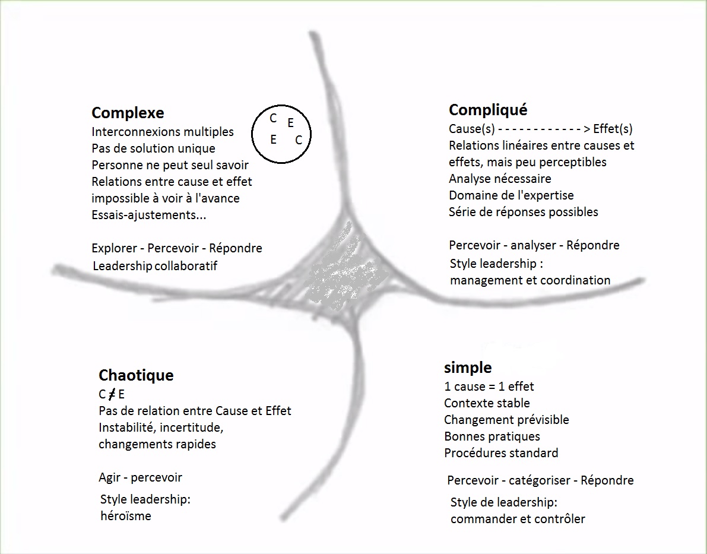

<!--

---
title: 4 niveaux de complexité d'un système 
description: Un système est un ensemble d'éléments interagissant entre eux selon certains principes ou règles. Les  études sur la complexité distinguent 4 niveaux de complexité décrits ici.
licence: CC-BY-SA
---

-->

# 4 niveaux de complexité d'un système

Un système est un ensemble d'éléments interagissant entre eux selon certains principes ou règles. Les  études sur la complexité distinguent 4 niveaux de complexité:

Simple
Les problèmes sont prévisibles et peuvent être résolus.
Les « meilleures pratiques » fonctionnent comme prévu.
Si on suit la recette, les chances de succès sont grandes.

Compliqué
Avec suffisamment de recherche, d’expertise et d’expérimentation, il est possible de prévoir l’issue d’une suite d’étapes.
On peut se fier à la gestion de projet et aux experts pour trouver une solution rationnelle aux problèmes.

Complexe
Les experts ne peuvent pas prévoir avec exactitude l’évolution du système.
Les plans ne fonctionnent que rarement comme prévu.
Les méthodes de résolution de problèmes ne suffisent pas.

Chaotique
Le système est instable et au bord de l’éclatement.
Le futur est impossible à prévoir et peut changer très rapidement.
Les gens ne s’entendent pas sur ce qu’il faut faire et sur comment il faut le faire.

