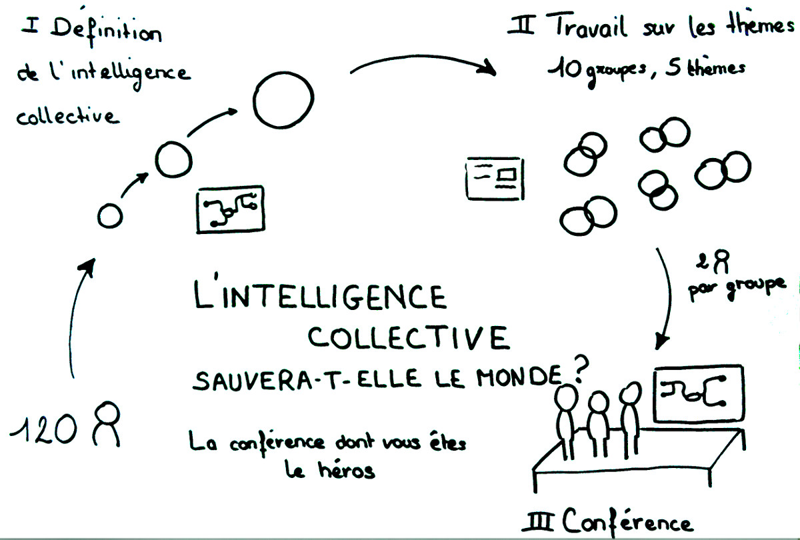
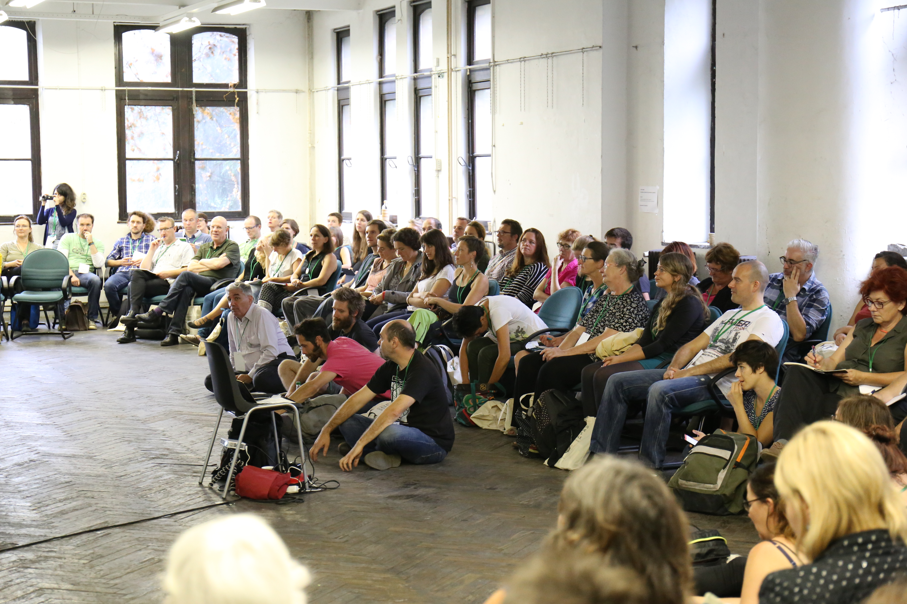
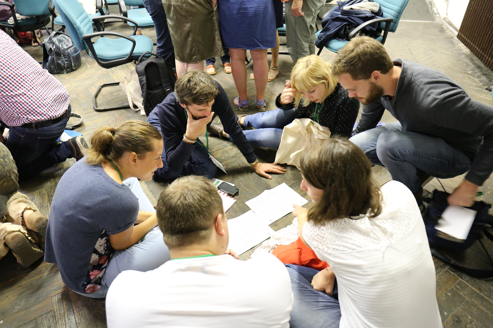
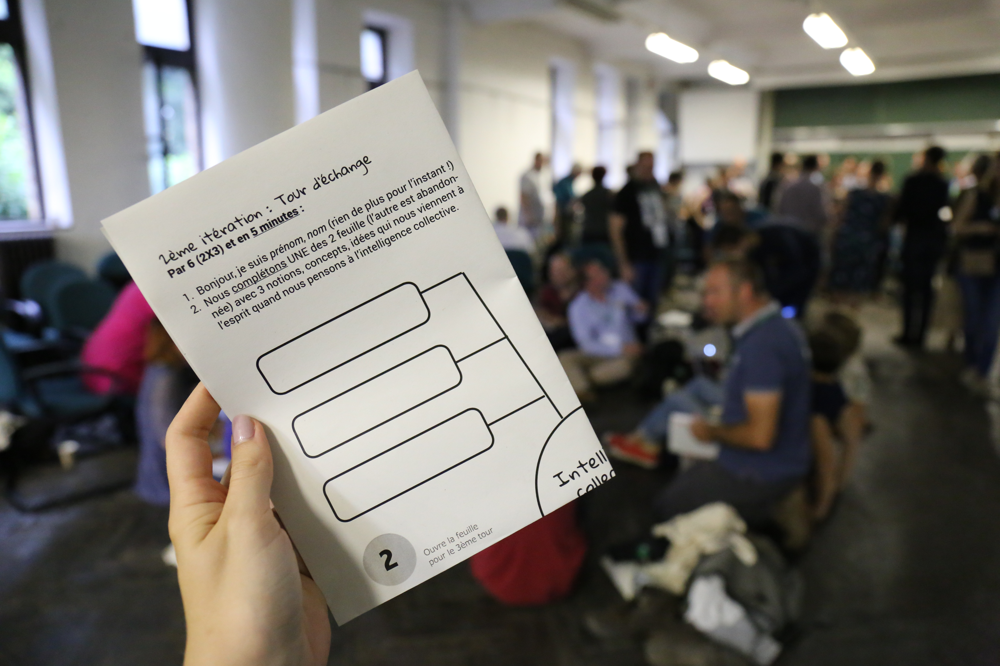

<!--

---
title: Conférence sans conférencier
description: Voici une format où un thème est collectivement exploré par un large groupe afin de produire une conférence, le tout dans un temps très court.
image_url: 
licence: CC-BY-SA
---

-->

# Conférence sans conférencier

Voici une format où un thème est collectivement exploré par un large groupe afin de produire une conférence, le tout dans un temps très court.

Ce format permet de:
- créer de la rencontre entre les participants
- vivre une expérience co-construction
-  co-construire un savoir commun sur un thème. 

Il a été testé lors des rencontres Co-construire 2017 sur le thème l'intelligence collective
            

## C'est quoi une conférence ?

Avant de démarrer il faut comprendre ce qui fait la specificité du format conférence.

que contient une CONFÉRENCE ?

- Un CONFÉRENCIER: Les bons partagent, les moins bons "vendent" un produit, les bons savent parler devant les gens... les moins bons sont pas tjrs amusants à écouter, captive son auditoire, éloquent. Il/le possède une EXPERTISE RECONNUE, un SAVOIR A PARTAGER, de l'ÉLOQUENCE, la manière de dire, art du discours, capacité à convaincre un auditoire (GRAND GROUPE)
- une PRÉSENTATION ORALE
- un SUJET
- une CONFRONTATION D'IDÉES sur un sujet jugé d'importance par les participants. Elle a ses origines dans la maïeutique et l'enseignement universitaire où souvent un orateur cherchait à définir un sujet, en en différenciant les éléments, et en confrontant et discutant différentes hypothèses.
- des INFORMATIONS TRANSMISES à un large auditoire des informations sur un sujet.
- une ORGANISATION FORMELLE (qui est formulé précisément)
- une STRUCTURE DE PRÉSENTATION
 - OUVERTURE
 - AFFIRMATION FORTE/PROVOCANTE
 - HISTOIRE ILLUSTRATIVE
 - LISTE DES IDÉES FORTES (3 à 5) souvent exprimées sous un format PED (POINT, EXEMPLE, DISCUSSION)
- CLOTURE
- un TEMPS LIMITÉ ( généralement de 15 à 120 minutes
- SUPPORT DE PRESENTATION (on est passé de tableau noir, aux diapositives, rétroprojecteur, puis vidéoprojecteur et logiciels spécialisés)
- des RÉSUMÉS (des actes résumant ou citant les différentes interventions, et présentant les intervenants) .
- un temps de QUESTIONS-REPONSES est souvent prévu pour les échanges avec le public,

En option: 
Le conférencier est souvent placé sur une ESTRADE, ou debout devant un PUPITRE, éventuellement muni d'un MICRO.

## Le format résumé en quelques mots

Le déroulé global se déroulé en 3 partie principales:
1. définition collective du sujet: création collective de sens sur le sujet à explorer
2. travail collectifs sur des thèmes: co-construire un savoir commun sur les hypothèses
3. conférence

## A péparer avant

### Mindmap exploration du sujet

- au centre le concept à étudier
- 12 bulles

Lien vers le fichier au format PDF:

Lien vers le fichier source au format scribus: 

### Matrice d'aide à la réflexion sur les thèmes

Une matrice pense bête à remplir pour les hypothèses. Contient
- question
- reformuler/repréciser la question
- un exemple concret
- un regard critique 
- un regard positif (rôle à prévoir)
- % de personnes pour, contre, indécises

Lien vers le fichier au format PDF:

Lien vers le fichier source au format scribus: 
            
### Informer des complices

- gardien du temps
- scribe mindmpa
- facilitateurs qui ont pour rôle de mettre les groupes en mouvement par l'exemple (bouger des que la cloche sonne, répondre aux incompréhensions des autres participants, ...)
- ...

### Vidéoprojection des consignes

il est fortement conseillé de projeter les consignes pour être sur que les participants comprennent bien et ne perde pas de temps. Essentiel pour des grands groupes.

### Déroulé du format

Voici le contenu utilisé pour co-construire 2017 sur le thème de l'intelligence collective.

Le fichier au format PDF pour présentation:

Le fichier source au format markdown (modifiable avec le logiciel de présenation Marp)

#### _L'intelligence collective sauvera-t-elle l'humanité ou est-ce une mode de plus ?_
la conférence dont vous êtes le héros !

---

#### Votre mission si vous l'acceptez:
- co-construire une conférence sans conférencier
- expérimenter (on prendra peut être une gamelle, mais c'est pas grave)
- se rencontrer et passer un bon moment

**pour réussir à plus de 100 et en une heure: le temps sera limité, _allez à l'essentiel !!!_** 

---

#### Déroulé

---

#### Règles du jeu

- soyez bienveillants
- tous les points de vues sont légitimes, il n'y a pas une vérité absolue
- évitez les monologues ou les ping pong à 2: une astuce: utilisez un baton de parole

---

#### 1er partie: définition collective de l'intelligence collective

---
#### 1ère itération: Tour de chauffe

- se placer par 3 avec une mindmap papier
- se présenter les uns aux autres (nom-prénom, rien de plus pour l’instant !)
- discutez pour identifier 3 notions, concepts, idées qui vous viennent à l’esprit quand vous pensez à l’intelligence collective.
- **Vous avez 3 min !**

---
#### 2ème itération : Tour d’échange

- chaque trinome s'associe à un autre trinome
- se présenter les uns aux autres  (nom-prénom)
- par 6, discutez les notions déja identifiées
- **complétez** UNE des 2 feuilles (l’autre est abandonnée) avec 3 notions supplémentaires
- **Vous avez 5 min !**

---

#### 3ème itération : Tour d’affinage

- chaque groupe de 6 s'associe à un autre groupe de 6
- se présenter les uns aux autres (nom-prénom)
- par 12, discutez les notions déja identifiées
- complétez UNE des 2 feuilles (l’autre est abandonnée) avec 6 notions, concepts,idées supplémentaires
- **Vous avez 7 min !**
- La feuille complétée est recoltée par des complices.

---

#### 2eme partie: travail sur les thèmes/hypothèses

---

#### Capitalisation définition de l'IC

- 2 sous-groupes de 12 participants
- rédiger une synthèse

---

#### Travail sur les hypothèses

il y aura 8 sous-groupes, travaillant sur 4 hypothèses, soit 2 groupes par hypothèses.

---

#### Les hypothèses
- L'intelligence collective peut-elle se passer du numérique ? 
- L'intelligence collective existe-t-elle vraiment dans l'enseignement ?
- L'intelligence collective peut-elle vraiment se pratiquer dans le privé ?
- L'intelligence collective peut-elle vraiment être menée à l'échelle d'un large territoire ?

---

#### Travail par groupe de 12

- utilisez la matrice comme outil d'aide à la reflexion
- Prévoyez un **scribe**
- **allez à l'essentiel, vous avez 10 min**

---

#### Recroisement des hypothèses entre les deux sous-groupes
- les 2 sous-groupes ayant travaillé sur la même question se rapprochent
- Compilation des travaux
- Choix des rapporteurs (si possible homme/femme)
- Soyez brefs dans vos échanges afin de vous partager la parole (**vous avez 10 min**)

---

#### 3eme partie: mode conférence
- préparation de la salle
- les rapporteurs ont **5 min** pour affiner leur discours.
- un scribe prends des notes sur une mindmap vidéo projetée en direct -> le support de présentation est ainsi crée au fur et à mesure

---

#### Conférence
- définition de l'intelligence collective (3-5 min)
- L'intelligence collective peut-elle se passer du numérique et/ou des licences libres ? (3-5 min)
- L'intelligence collective existe-t-elle vraiment dans l'enseignement ? (3-5 min)
- L'intelligence collective peut-elle vraiment se pratiquer dans le privé ? (3-5 min)
- L'intelligence collective peut-elle vraiment être menée à l'échelle d'un large territoire ? (3-5 min)
- conclusion (2 min)

---

<!---

Pour comprendre la complexité, avoir un seul point de vue ne suffit pas.

L'intelligence collective se nourrit de la diversité des points de vue. 

Comment créer des cadres qui favorisent l'intelligence collective, c'est ce que nous étudierons ensemble durant ces 3 jours.

--->

## Retours d'expérience et pistes d'amélioration

### Ce qui a marché

- avoir informé les complices avant et vérifié avec eux que les consignes étaient claires
- les supports papiers pour aider le groupe à réfléchir
- main levée pour demander le silence
- gestion relative du temps (prévoir large et donner plus de temps au groupe que ce que l'on leur annonce
- un gardien du temps dédié avec un objet sonore, mais avec un son qui n'est pas aggressif
- une persone dédié qui produit un support de présentation sous forme de mindmap
- production de sens et d'une présentation à plus de 100 et en moins d'une heure trente ! 
- convivialité, rencontre entre les gens
- ...

### Ce qui est à améliorer

- baton de parole (mieux expliquer, avoir un  objet plus joli/visible?)
- s'assurer que les consignes vidéo projetées sont visibles de partout dans la salle

Pour pouvoir aller plus loin sur les contenus produits: 
- la mise en perspective des hypothèses (les divers points de vues sur les thèmes) 
- le lien entre les thèmes
- le rapport entre personnes plus "expertes" qui pourraient amener le groupe à aller plus loin et le savoir qui émerge du groupe.
- la distribution des fichiers d'aide aux personnes (prévoir des complices dédiés).
- ...

## Source 
CC-BY-SA
Gatien Bataille, Lilian Ricaud, ...

